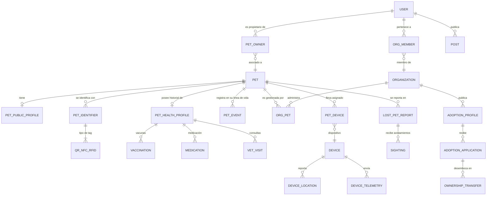

# 🐾 Petuno

> **La identidad digital de tu mascota. Una mascota. Una identidad.**

Petuno es una plataforma gratuita y open source enfocada en la **identificación, protección, salud, adopción, recuperación y gestión integral de mascotas**. Su propósito es otorgar a cada mascota una identidad digital única y centralizada para conectar de manera segura y eficiente a propietarios, veterinarias, fundaciones, refugios y la comunidad.

---

## 🎯 Objetivos del Proyecto

*   **Identidad única:** Crear un perfil digital centralizado para cada mascota mediante el **Petuno ID**.
*   **Identificación multitecnología:** Facilitar la lectura y acceso al perfil utilizando códigos **QR**, tags **NFC** y microchips **RFID**.
*   **Recuperación activa:** Ayudar a encontrar mascotas perdidas mediante alertas comunitarias y reportes de avistamiento geolocalizados.
*   **Adopción responsable:** Facilitar el flujo completo de adopción, desde la publicación por fundaciones hasta el traspaso formal de propiedad.
*   **Línea de vida (Petuno Life):** Mantener un historial cronológico completo de los eventos más significativos del animal (nacimiento, vacunas, consultas, adopciones).
*   **Salud y bienestar:** Gestionar vacunas, medicamentos, alergias y visitas veterinarias.
*   **Integración de hardware:** Preparar el ecosistema para integrar dispositivos de localización GPS y telemetría IoT.

---

## 🌎 Concepto de Identidad

Cada mascota en Petuno tiene una única identidad digital que puede ser consultada por múltiples vías físicas:

```text
                         PETUNO ID (e.g. PTO-82A91X)
                                     │
                      ┌──────────────┼──────────────┐
                      │              │              │
                     QR             NFC            RFID
                      │              │              │
                      └──────────────┼──────────────┘
                                     │
                                 MASCOTA (PET)
                                     │
                ┌────────────┬───────┼────────┬─────────────┐
                │            │       │        │             │
            Propietario    Salud   Life    Pérdida     Dispositivos
                │            │       │        │             │
                └────────────┴───────┼────────┴─────────────┘
                                     │
                                PETUNO LIFE
```

---

## 🎨 Identidad Visual y Estilo

Petuno se diseña bajo la premisa de ser una plataforma moderna, profesional y amigable, con la estética de una startup de software premium y no como un simple software administrativo o veterinario convencional.

*   **Tipografía:** Inter (Sans-serif moderna).
*   **Estilo Visual:** Bordes redondeados (10–16px / `rounded-xl` a `rounded-2xl`), sombras muy sutiles, mucho espacio en blanco (whitespace) y sin emojis en iconos principales de la interfaz.

### Paleta de Colores

| Categoría | Nombre de Color | HEX | Uso Principal |
| :--- | :--- | :--- | :--- |
| **Primary** | Petuno Purple | `#6C4CE8` | Interacción principal / Botones / Brand |
| | Petuno Purple Dark | `#4F36B8` | Hover / Estados activos |
| | Petuno Purple Light| `#8B72F2` | Elementos secundarios / Bordes seleccionados |
| | Petuno Purple 50 | `#F5F3FF` | Fondos suaves |
| **Secondary**| Petuno Sky | `#4DA8DA` | Elementos informativos y alternos |
| **Success** | Petuno Mint | `#35B779` | Mascotas encontradas, estados activos |
| **Warning** | Petuno Amber | `#F4B942` | Advertencias de vencimiento o cuidado |
| **Danger** | Petuno Coral | `#E85D5D` | Mascotas perdidas, errores o alertas críticas |
| **Neutros Light**| Background | `#F8FAFC` | Fondo principal de la aplicación |
| | Surface | `#FFFFFF` | Tarjetas (Cards), contenedores |
| | Border | `#E4E7EC` | Separadores y bordes de inputs |
| | Text Primary | `#1F2937` | Texto principal legible |
| | Text Secondary | `#667085` | Subtítulos y metadatos |
| **Neutros Dark** | Background | `#0F1020` | Fondo principal en Modo Oscuro |
| | Surface | `#18192B` | Contenedores en Modo Oscuro |
| | Surface Elevated | `#202238` | Elementos elevados en Modo Oscuro |

---

## 🛠️ Stack Tecnológico

Petuno se compone de un frontend interactivo y una arquitectura de backend robusta basada en un **Modular Monolith** siguiendo los principios de **Clean Architecture**.

### 🎨 Frontend
*   **Framework:** Angular (TypeScript) con arquitectura de reactividad moderna utilizando **Signals** y **RxJS**.
*   **Estilos:** Tailwind CSS.
*   **Componentes:** PrimeNG para interfaces complejas e interacciones ricas.
*   **Mapas:** Leaflet para la visualización de avistamientos y geocercas.
*   **Librerías clave:** `qrcode` para renderizar los códigos de identificación dinámicos de forma local.
*   **Pruebas:** Angular Testing + Jasmine (Unitarias) y Playwright (End-to-End).

### ⚙️ Backend & Base de Datos
*   **Framework API:** ASP.NET Core 10 (C#) estructurado en un monolito modular.
*   **Persistencia:** PostgreSQL como base de datos principal, extendido con **PostGIS** para consultas geoespaciales avanzadas (coordenadas de avistamientos, geocercas, rangos de búsqueda).
*   **Acceso a Datos:** Entity Framework Core (EF Core) con FluentValidation para peticiones y Mapster para DTOs.
*   **Caché:** Valkey (Caché de alto rendimiento y almacenamiento en memoria).
*   **Mensajería:** RabbitMQ para comunicación asíncrona mediante eventos de dominio.
*   **Procesamiento:** .NET Worker Services y Quartz.NET para tareas programadas (Jobs).
*   **Archivos:** MinIO (Almacenamiento de objetos compatible con S3) para subir y servir fotos de mascotas, registros médicos y documentos.

### 🌐 Infraestructura y Observabilidad
*   **Contenedores:** Docker & Docker Compose para empaquetamiento y orquestación local/inicial.
*   **Proxy Inverso & HTTPS:** Traefik + Let's Encrypt para routing y TLS automático.
*   **IaC:** OpenTofu para la declaración y aprovisionamiento de infraestructura.
*   **Telemetría:** OpenTelemetry para instrumentación de trazas y métricas.
*   **Visualización y Logs:** Prometheus (métricas), Loki (logs), Tempo (tracing) y Grafana OSS para dashboards de control y alertas.

### 📡 Especificaciones de Hardware e Identificación
*   **Códigos QR:** Enlace web público seguro (`https://petuno.com/p/{token}`) que oculta datos sensibles del dueño.
*   **NFC:** Compatibilidad con tags estándar NTAG213, NTAG215 y NTAG216.
*   **RFID:** Microchips bajo el estándar ISO 11784/11785 FDX-B operando en la frecuencia de 134.2 kHz.
*   **IoT:** MQTT (Mosquitto) para futuras transmisiones de GPS activo y telemetría de red LTE-M/GNSS/BLE.

---

## 🗄️ Modelo de Datos (MER)

El modelo de base de datos gira en torno a la entidad **Pet** (Mascota) como núcleo central. Esto permite que el historial y la identidad de una mascota persistan aunque cambie de propietario (por ejemplo, al ser trasladada a una fundación y luego adoptada).

### Fases de Implementación del Modelo

1.  **Fase 1 (Core):** `User`, `Pet`, `PetOwner` (Relación N:M histórica), `PetPublicProfile` (1:1 configuración de visibilidad), `PetIdentifier` (QR, NFC o RFID) y `ContactRequest`.
2.  **Fase 2 (Organizaciones):** `Organization`, `OrganizationMember`, `OrganizationPet` (Fundación o Veterinaria administra temporalmente una mascota), `Role`, `Permission`, `RolePermission` y `AuditLog`.
3.  **Fase 3 (Salud + Life):** `PetHealthProfile`, `Vaccine`, `PetVaccination`, `Medication`, `VeterinaryVisit`, `Document` y `PetEvent` (Línea de tiempo).
4.  **Fase 4 (Mascotas Perdidas):** `LostPetReport`, `Sighting` (Avistamientos con coordenadas PostGIS) y `LostPetAlert`.
5.  **Fase 5 (Adopción + Comunidad):** `AdoptionProfile`, `AdoptionApplication`, `AdoptionEvent`, `PetOwnershipTransfer`, `CommunityPost`, `CommunityComment`, `CommunityReaction`, `DonationCampaign` y `Donation`.
6.  **Fase 6 (Dispositivos / IoT):** `Device`, `PetDevice`, `DeviceLocation` y `DeviceTelemetry`.

### Diagrama MER Relacional



---

## 🧭 Estructura de Navegación del Sistema

### 🌎 Experiencia Pública
*   `/` (Home Landing Page y buscador de avistamiento rápido)
*   `/features` (Funcionalidades principales)
*   `/how-it-works` (QR, NFC, RFID, plataforma)
*   `/lost-pets` & `/lost-pets/{id}` (Mapa y perfiles públicos de búsqueda de mascotas perdidas)
*   `/adoption` & `/adoption/{id}` (Catálogo de adopciones y detalles de la mascota)
*   `/pricing` (Detalles de los planes Free / Premium)
*   `/help` (Centro de ayuda y FAQs)
*   `/contact` (Formulario de contacto general)
*   `/p/{token}` (Perfil público y seguro de una mascota al escanear su identificación física)
*   `/p/{token}/contact` (Contacto anónimo con el propietario)

### 👤 Experiencia Privada (App Dashboard)
*   `/app` (Panel de resumen, próximas vacunas y accesos rápidos)
*   `/app/pets` (Lista y cuadrícula de mascotas registradas)
*   `/app/pets/new` (Asistente de registro de nueva mascota con Petuno ID autogenerado)
*   `/app/pets/{id}` (Muro principal de la mascota con pestañas de Resumen, Salud, Identidad, Ubicación, Documentos, Historial y Configuración)
*   `/app/settings` (Gestión del perfil del usuario, sesiones, seguridad 2FA y configuración de familia)

---

## 🚀 Despliegue de Infraestructura con Docker Compose

Toda la infraestructura básica necesaria para el desarrollo de Petuno se encuentra parametrizada en el archivo [`.env`](file:///c:/Proyectos/NeuralNet/Petuno/.env) y se puede levantar fácilmente con Docker Compose.

### Requisitos Previos
*   Tener instalado [Docker Desktop](https://www.docker.com/products/docker-desktop/) (que incluye Docker Compose).

### Comandos Principales

*   **Iniciar todos los servicios (en segundo plano):**
    ```bash
    docker compose up -d
    ```
*   **Verificar el estado de los contenedores:**
    ```bash
    docker compose ps
    ```
*   **Ver los logs en tiempo real (todos los servicios o uno específico):**
    ```bash
    # Todos los servicios
    docker compose logs -f
    
    # Solo base de datos
    docker compose logs -f postgres
    ```
*   **Detener los servicios (sin borrar volúmenes persistentes):**
    ```bash
    docker compose down
    ```
*   **Detener los servicios y limpiar volúmenes de datos (reinicio de base limpia):**
    ```bash
    docker compose down -v
    ```

### 🔗 Direcciones y Consolas de Administración Local

Una vez levantado el entorno, puedes acceder a las herramientas de desarrollo en tu navegador:

| Servicio | Consola de Administración / API | Dirección Local |
| :--- | :--- | :--- |
| **Traefik** | Dashboard de Red | [http://localhost:8080](http://localhost:8080) |
| **MinIO** | Consola de Object Storage | [http://localhost:9001](http://localhost:9001) *(User: minio_admin / Pass: minio_secure_pass_123)* |
| **Kafka UI** | Dashboard de Tópicos y Consumidores | [http://localhost:8090](http://localhost:8090) |
| **OpenBao** | API / Panel de Control de Secretos | [http://localhost:8200](http://localhost:8200) *(Token: bao_root_token_123)* |
| **PostgreSQL** | Base de Datos (Host directo) | `localhost:5432` *(User: petuno_admin / Pass: petuno_secure_pass_123)* |
| **Mosquitto** | MQTT Broker (Puerto IoT) | `localhost:1883` |
| **Valkey** | Caché (Puerto directo) | `localhost:6379` |

